# NovAgent Architecture Analysis

**Date:** October 28, 2025
**Version:** 2.0.0
**Analysis for:** Tech Stack, Database, and Integration Architecture

---

## Table of Contents

1. [Tech Stack: Tools, Model, and DB Relationships](#1-tech-stack-tools-model-and-db-relationships)
2. [Memory = DB Architecture](#2-memory--db-architecture)
3. [Knowledge, CRM, and Google Calendar Integration](#3-knowledge-crm-and-google-calendar-integration)
4. [Comprehensive Architecture Diagrams](#4-comprehensive-architecture-diagrams)

---

## 1. Tech Stack: Tools, Model, and DB Relationships

### Overview

NovAgent uses a **LangChain-based AI agent architecture** with the following core components:

| Component | Technology | Purpose |
|-----------|------------|---------|
| **AI Agent** | LangChain + Groq LLM | Conversational AI orchestration |
| **LLM Model** | llama-3.3-70b-versatile | Natural language understanding |
| **Database** | PostgreSQL 15 + Prisma ORM | Persistent storage |
| **Tools** | Custom LangChain Tools | Pricing calculation, knowledge retrieval |
| **Integration** | WhatsApp Web.js | Multi-user messaging |

### Architecture Flow: Tools → Agent → Model → Database

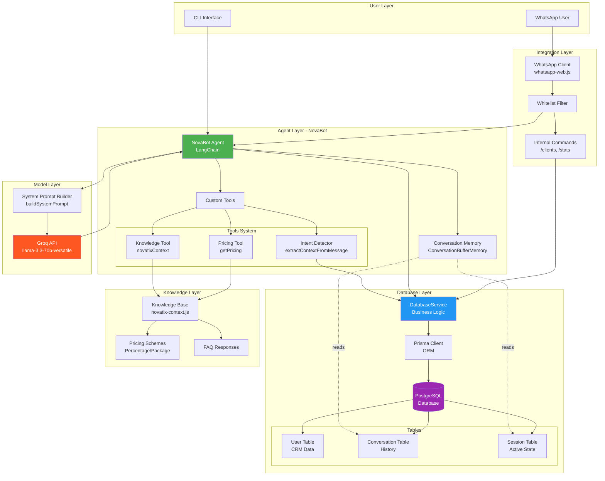
```mermaid
graph TB
    subgraph "User Layer"
        WA[WhatsApp User]
        CLI[CLI Interface]
    end

    subgraph "Integration Layer"
        WAC[WhatsApp Client<br/>whatsapp-web.js]
        WL[Whitelist Filter]
        IC[Internal Commands<br/>/clients, /stats]
    end

    subgraph "Agent Layer - NovaBot"
        AGENT[NovaBot Agent<br/>LangChain]
        MEMORY[Conversation Memory<br/>ConversationBufferMemory]
        TOOLS[Custom Tools]

        subgraph "Tools System"
            PT[Pricing Tool<br/>getPricing]
            KT[Knowledge Tool<br/>novatixContext]
            IT[Intent Detector<br/>extractContextFromMessage]
        end
    end

    subgraph "Model Layer"
        GROQ[Groq API<br/>llama-3.3-70b-versatile]
        PROMPT[System Prompt Builder<br/>buildSystemPrompt]
    end

    subgraph "Database Layer"
        DBS[DatabaseService<br/>Business Logic]
        PRISMA[Prisma Client<br/>ORM]
        PG[(PostgreSQL<br/>Database)]

        subgraph "Tables"
            USER[User Table<br/>CRM Data]
            CONV[Conversation Table<br/>History]
            SESS[Session Table<br/>Active State]
        end
    end

    subgraph "Knowledge Layer"
        KB[Knowledge Base<br/>novatix-context.js]
        PRICING[Pricing Schemes<br/>Percentage/Package]
        FAQ[FAQ Responses]
    end

    WA --> WAC
    CLI --> AGENT
    WAC --> WL
    WL --> IC
    WL --> AGENT

    IC --> DBS

    AGENT --> MEMORY
    AGENT --> TOOLS
    AGENT --> PROMPT

    TOOLS --> PT
    TOOLS --> KT
    TOOLS --> IT

    PT --> KB
    KT --> KB
    KB --> PRICING
    KB --> FAQ

    PROMPT --> GROQ
    GROQ --> AGENT

    AGENT --> DBS
    IT --> DBS

    DBS --> PRISMA
    PRISMA --> PG

    PG --> USER
    PG --> CONV
    PG --> SESS

    MEMORY -.reads.-> SESS
    MEMORY -.reads.-> CONV

    style AGENT fill:#4CAF50,color:#fff
    style GROQ fill:#FF5722,color:#fff
    style DBS fill:#2196F3,color:#fff
    style PG fill:#9C27B0,color:#fff
```

### Component Relationships Explained

#### 1. **NovaBot Agent (Core Orchestrator)**
- **File:** `apps/whatsapp-bot/src/agent/novabot.js`
- **Key Methods:**
  - `chat()` - Main conversation handler
  - `extractContextFromMessage()` - Auto-extracts CRM data (nama, instansi, event, ticketPrice, capacity)
  - `buildSystemPrompt()` - Constructs context-aware prompts
  - `resetConversation()` - Clears session memory

#### 2. **Tools System (LangChain Custom Tools)**
- **Pricing Tool:** Calculates pricing based on ticket price + capacity
- **Knowledge Tool:** Retrieves FAQ and product information from `novatix-context.js`
- **Intent Detector:** Extracts structured data from unstructured text

#### 3. **Model Layer (Groq LLM)**
- Uses `llama-3.3-70b-versatile` for production
- Alternative: `llama-3.1-8b-instant` for faster responses
- System prompts include:
  - NovaTix product knowledge
  - Current user context (nama, instansi, event)
  - Conversation history (via ConversationBufferMemory)

#### 4. **Database Service Layer**
- **File:** `packages/database/src/database-service.js`
- **24 Methods** for CRUD, analytics, and search
- **Key Operations:**
  - `getOrCreateUser()` - User management
  - `saveConversation()` - History persistence
  - `updateSession()` - Active session state
  - `searchClients()` - CRM search functionality
  - `getOverallStats()` - Analytics

### Data Flow Example: User Message Processing

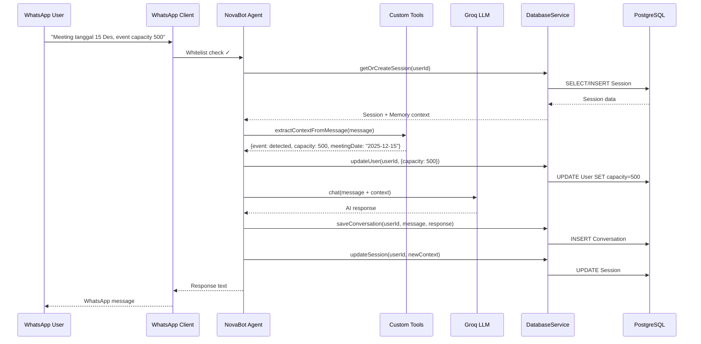
```mermaid
sequenceDiagram
    participant User as WhatsApp User
    participant WA as WhatsApp Client
    participant Agent as NovaBot Agent
    participant Tools as Custom Tools
    participant Model as Groq LLM
    participant DB as DatabaseService
    participant PG as PostgreSQL

    User->>WA: "Meeting tanggal 15 Des, event capacity 500"
    WA->>Agent: Whitelist check ✓
    Agent->>DB: getOrCreateSession(userId)
    DB->>PG: SELECT/INSERT Session
    PG-->>DB: Session data
    DB-->>Agent: Session + Memory context

    Agent->>Tools: extractContextFromMessage(message)
    Tools-->>Agent: {event: detected, capacity: 500, meetingDate: "2025-12-15"}

    Agent->>DB: updateUser(userId, {capacity: 500})
    DB->>PG: UPDATE User SET capacity=500

    Agent->>Model: chat(message + context)
    Model-->>Agent: AI response

    Agent->>DB: saveConversation(userId, message, response)
    DB->>PG: INSERT Conversation

    Agent->>DB: updateSession(userId, newContext)
    DB->>PG: UPDATE Session

    Agent-->>WA: Response text
    WA-->>User: WhatsApp message
```

---

## 2. Memory = DB Architecture

### Core Concept: **Memory-Backed Sessions**

NovAgent implements a **hybrid memory system** where:
- **Short-term memory:** LangChain `ConversationBufferMemory` (in-process)
- **Long-term memory:** PostgreSQL `Session` + `Conversation` tables (persistent)

### Database Schema

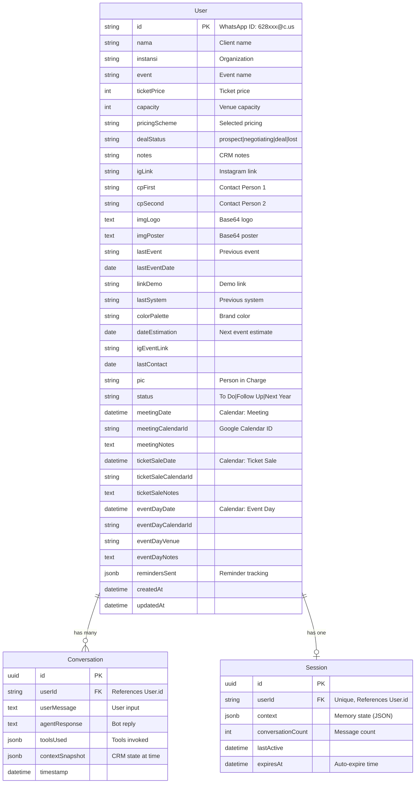
```mermaid
erDiagram
    User ||--o{ Conversation : "has many"
    User ||--o| Session : "has one"

    User {
        string id PK "WhatsApp ID: 628xxx@c.us"
        string nama "Client name"
        string instansi "Organization"
        string event "Event name"
        int ticketPrice "Ticket price"
        int capacity "Venue capacity"
        string pricingScheme "Selected pricing"
        string dealStatus "prospect|negotiating|deal|lost"
        string notes "CRM notes"

        string igLink "Instagram link"
        string cpFirst "Contact Person 1"
        string cpSecond "Contact Person 2"
        text imgLogo "Base64 logo"
        text imgPoster "Base64 poster"
        string lastEvent "Previous event"
        date lastEventDate
        string linkDemo "Demo link"
        string lastSystem "Previous system"
        string colorPalette "Brand color"
        date dateEstimation "Next event estimate"
        string igEventLink
        date lastContact
        string pic "Person in Charge"
        string status "To Do|Follow Up|Next Year"

        datetime meetingDate "Calendar: Meeting"
        string meetingCalendarId "Google Calendar ID"
        text meetingNotes

        datetime ticketSaleDate "Calendar: Ticket Sale"
        string ticketSaleCalendarId
        text ticketSaleNotes

        datetime eventDayDate "Calendar: Event Day"
        string eventDayCalendarId
        string eventDayVenue
        text eventDayNotes

        jsonb remindersSent "Reminder tracking"

        datetime createdAt
        datetime updatedAt
    }

    Conversation {
        uuid id PK
        string userId FK "References User.id"
        text userMessage "User input"
        text agentResponse "Bot reply"
        jsonb toolsUsed "Tools invoked"
        jsonb contextSnapshot "CRM state at time"
        datetime timestamp
    }

    Session {
        uuid id PK
        string userId FK "Unique, References User.id"
        jsonb context "Memory state (JSON)"
        int conversationCount "Message count"
        datetime lastActive
        datetime expiresAt "Auto-expire time"
    }
```

### Memory Architecture Explained

#### **1. User Table (CRM Data)**
- **Primary Key:** `id` (WhatsApp ID format: `628123456789@c.us`)
- **CRM Fields:** Basic customer info (nama, instansi, event, ticketPrice, capacity)
- **Dashboard Fields:** Extended CRM data migrated from legacy `fe-won` system
- **Calendar Fields:** Google Calendar integration (3 event types)
- **Indexes:** Optimized for search (nama, instansi, dealStatus, status, pic, createdAt)

#### **2. Conversation Table (Long-term History)**
- **Purpose:** Persistent chat history for analysis and context
- **Key Fields:**
  - `userMessage` / `agentResponse` - Full conversation text
  - `toolsUsed` - JSON array of invoked tools (e.g., `["pricingTool", "knowledgeTool"]`)
  - `contextSnapshot` - CRM state at time of message (e.g., `{nama: "John", instansi: "Acme"}`)
- **Cascade Delete:** When User deleted, all conversations auto-delete
- **Indexes:** Compound index on `(userId, timestamp DESC)` for fast retrieval

#### **3. Session Table (Active Memory State)**
- **Purpose:** Active conversation context (replaces in-memory sessions)
- **Key Fields:**
  - `context` - JSON blob storing LangChain memory state
  - `conversationCount` - Number of exchanges in current session
  - `lastActive` - Last message timestamp (for auto-expire)
  - `expiresAt` - Configurable session timeout
- **One-to-One:** Each User has at most one active Session
- **Cleanup:** `cleanupOldSessions()` removes expired sessions

### Memory Persistence Flow

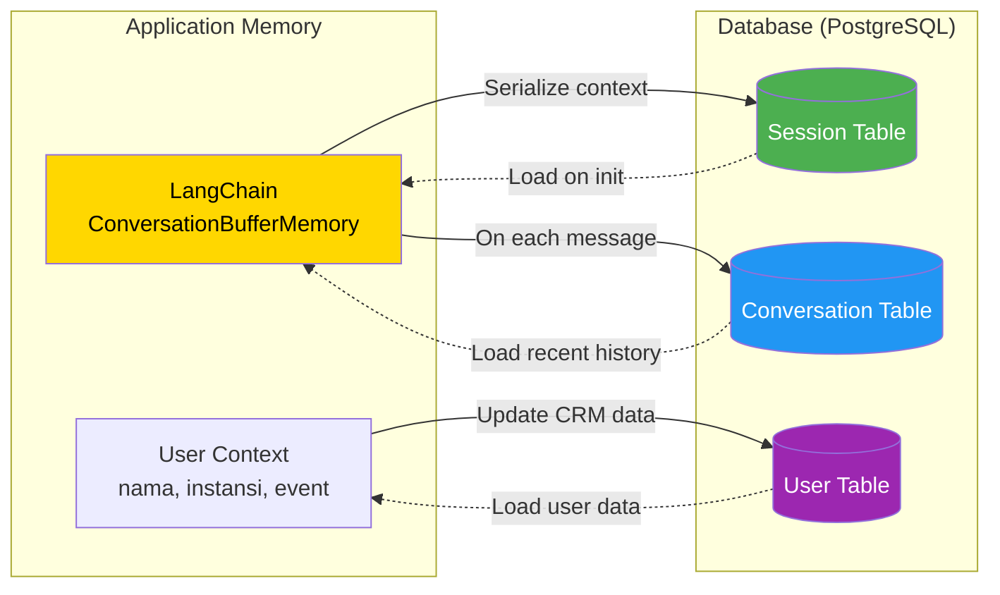
```mermaid
flowchart LR
    subgraph "Application Memory"
        LCM[LangChain<br/>ConversationBufferMemory]
        CTX[User Context<br/>nama, instansi, event]
    end

    subgraph "Database (PostgreSQL)"
        SESS[(Session Table)]
        CONV[(Conversation Table)]
        USER[(User Table)]
    end

    LCM -->|On each message| CONV
    LCM -->|Serialize context| SESS
    CTX -->|Update CRM data| USER

    SESS -.->|Load on init| LCM
    CONV -.->|Load recent history| LCM
    USER -.->|Load user data| CTX

    style LCM fill:#FFD700,color:#000
    style SESS fill:#4CAF50,color:#fff
    style CONV fill:#2196F3,color:#fff
    style USER fill:#9C27B0,color:#fff
```

### Session Lifecycle

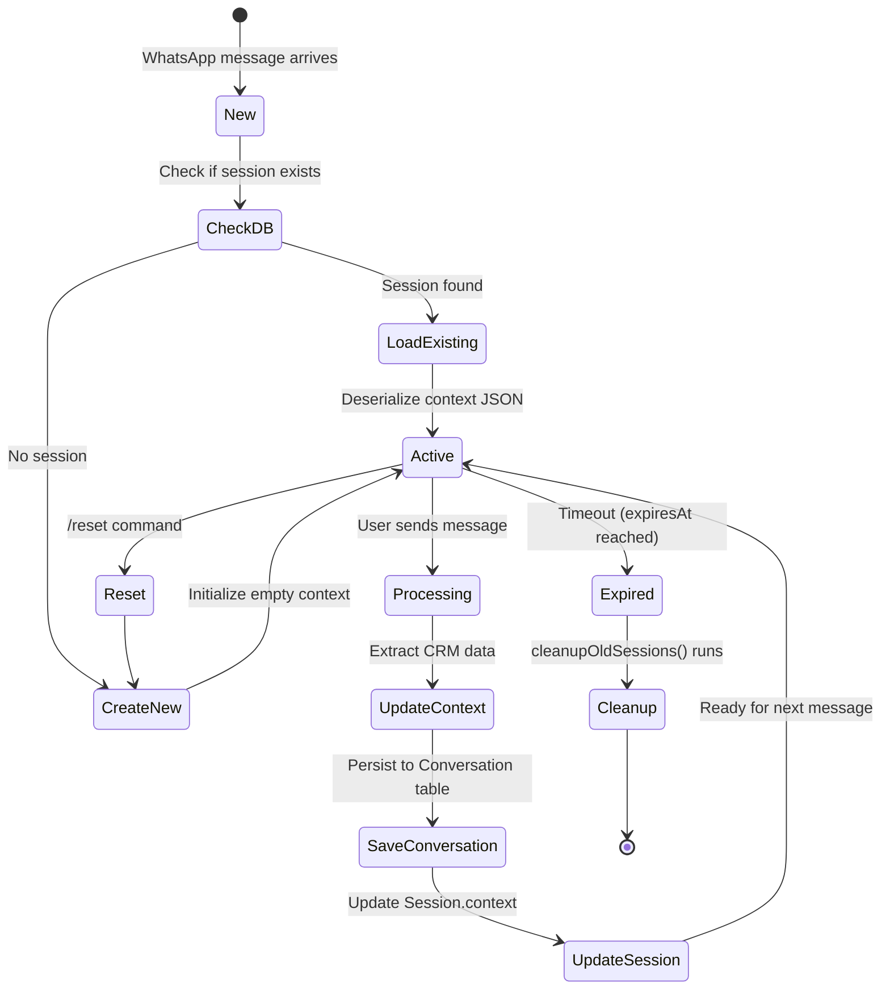
```mermaid
stateDiagram-v2
    [*] --> New: WhatsApp message arrives
    New --> CheckDB: Check if session exists
    CheckDB --> LoadExisting: Session found
    CheckDB --> CreateNew: No session

    LoadExisting --> Active: Deserialize context JSON
    CreateNew --> Active: Initialize empty context

    Active --> Processing: User sends message
    Processing --> UpdateContext: Extract CRM data
    UpdateContext --> SaveConversation: Persist to Conversation table
    SaveConversation --> UpdateSession: Update Session.context
    UpdateSession --> Active: Ready for next message

    Active --> Expired: Timeout (expiresAt reached)
    Expired --> Cleanup: cleanupOldSessions() runs
    Cleanup --> [*]

    Active --> Reset: /reset command
    Reset --> CreateNew
```

### Why This Architecture?

| Problem | Solution |
|---------|----------|
| **Process restart loses memory** | Session table persists context as JSON |
| **Multiple instances need shared state** | PostgreSQL provides centralized session store |
| **Analytics require full history** | Conversation table logs all exchanges |
| **CRM data extraction** | Intent detector auto-updates User table |
| **Session bloat** | Auto-expire + cleanup prevents unbounded growth |

### Key Database Service Methods

```javascript
// Session Management
getOrCreateSession(userId)      // Load or initialize session
updateSession(userId, context)  // Persist memory state
deleteSession(userId)            // Manual reset
cleanupOldSessions()            // Remove expired sessions

// Conversation History
saveConversation(userId, userMsg, agentMsg, tools, context)
getConversationHistory(userId, limit)
getRecentConversations(limit)

// User CRM
getOrCreateUser(userId)
updateUser(userId, data)
getUserWithHistory(userId)
findUserByPhoneOrName(query)

// Analytics
getOverallStats()               // Total users, conversations, sessions
getTodayActivity()              // Today's metrics
getActiveSessions()             // Currently active sessions
getUserStats(userId)            // Per-user metrics
```

---

## 3. Knowledge, CRM, and Google Calendar Integration

### Architecture Overview

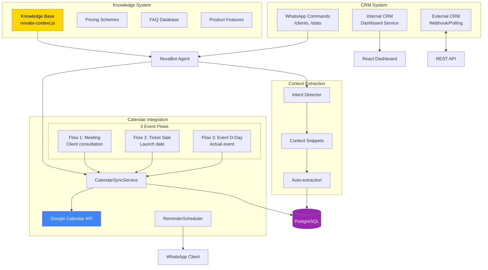
```mermaid
graph TB
    subgraph "Knowledge System"
        KB[Knowledge Base<br/>novatix-context.js]
        PRICING[Pricing Schemes]
        FAQ[FAQ Database]
        FEATURES[Product Features]
    end

    subgraph "CRM System"
        INTERNAL[Internal CRM<br/>Dashboard Service]
        EXTERNAL[External CRM<br/>Webhook/Polling]
        COMMANDS[WhatsApp Commands<br/>/clients, /stats]
    end

    subgraph "Calendar Integration"
        GCAL[Google Calendar API]
        SYNC[CalendarSyncService]
        REMIND[ReminderScheduler]

        subgraph "3 Event Flows"
            F1[Flow 1: Meeting<br/>Client consultation]
            F2[Flow 2: Ticket Sale<br/>Launch date]
            F3[Flow 3: Event D-Day<br/>Actual event]
        end
    end

    subgraph "Context Extraction"
        INTENT[Intent Detector]
        SNIPPET[Context Snippets]
        AUTO[Auto-extraction]
    end

    KB --> AGENT[NovaBot Agent]
    INTERNAL --> DASHBOARD[React Dashboard]
    EXTERNAL <--> API[REST API]
    COMMANDS --> AGENT

    AGENT --> INTENT
    INTENT --> SNIPPET
    SNIPPET --> AUTO
    AUTO --> DB[(PostgreSQL)]

    AGENT --> SYNC
    SYNC --> GCAL
    SYNC --> DB
    REMIND --> WA[WhatsApp Client]

    F1 --> SYNC
    F2 --> SYNC
    F3 --> SYNC

    style KB fill:#FFD700,color:#000
    style GCAL fill:#4285F4,color:#fff
    style DB fill:#9C27B0,color:#fff
```

### 3.1 Knowledge Base System

#### Structure: `packages/knowledge/src/novatix-context.js`

```javascript
export const novatixContext = {
  companyInfo: {
    name: "NovaTix",
    description: "Platform ticketing untuk seated venue",
    target: "Event Organizer (EO)"
  },

  features: {
    main: [
      { name: "Pemilihan Tiket Seat-Based", description: "..." },
      { name: "Payment Gateway Integration", description: "..." },
      { name: "E-Ticket Verification", description: "..." },
      { name: "Data Analytics", description: "..." }
    ]
  },

  pricing: {
    percentage: {
      tiers: [
        { capacity: "0 - 750 pax", ranges: [...] },
        { capacity: "750 - 1500 pax", ranges: [...] },
        { capacity: "1500+ pax", ranges: [...] }
      ]
    },
    package: {
      tiers: [...]
    }
  },

  faq: [
    { question: "...", answer: "..." }
  ]
}
```

#### Integration with Agent

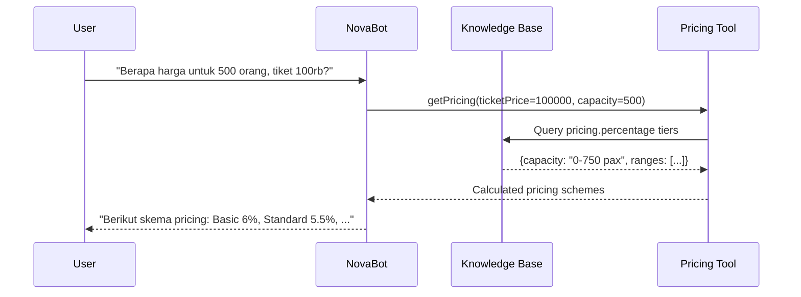
```mermaid
sequenceDiagram
    participant User
    participant Agent as NovaBot
    participant KB as Knowledge Base
    participant Tool as Pricing Tool

    User->>Agent: "Berapa harga untuk 500 orang, tiket 100rb?"
    Agent->>Tool: getPricing(ticketPrice=100000, capacity=500)
    Tool->>KB: Query pricing.percentage tiers
    KB-->>Tool: {capacity: "0-750 pax", ranges: [...]}
    Tool-->>Agent: Calculated pricing schemes
    Agent-->>User: "Berikut skema pricing: Basic 6%, Standard 5.5%, ..."
```

### 3.2 CRM Integration (Dual System)

#### Internal CRM (Dashboard)

**File:** `apps/dashboard-api/src/backend/services/crmService.js`

**Features:**
- React dashboard for client management
- Real-time conversation history
- Analytics and reporting
- User search and filtering

**API Endpoints:**
```
GET  /api/dashboard/users          # List all clients
GET  /api/dashboard/users/:id      # Get client details
PUT  /api/dashboard/users/:id      # Update client
GET  /api/dashboard/conversations/:userId  # Chat history
GET  /api/dashboard/stats          # Analytics
GET  /api/dashboard/search?q=...   # Search clients
```

#### External CRM (Integration)

**File:** `apps/dashboard-api/src/backend/services/externalCrmService.js`

**Supported Modes:**
1. **Webhook (Push):** External CRM → NovAgent
2. **Polling (Pull):** NovAgent → External CRM (scheduled)
3. **API Push:** NovAgent → External CRM (on-demand)

**Field Mapping:**
```javascript
mapExternalToInternal(externalData) {
  return {
    id: externalData.phone || externalData.whatsapp_id,
    nama: externalData.name || externalData.contact_name,
    instansi: externalData.company || externalData.organization,
    event: externalData.event_name,
    ticketPrice: externalData.ticket_price || externalData.price,
    capacity: externalData.capacity || externalData.venue_size,
    dealStatus: externalData.status || externalData.deal_stage,
    // ... additional mappings
  };
}
```

**Supported CRMs:**
- HubSpot
- Salesforce
- Zoho CRM
- Any REST-based CRM (customizable field mapping)

### 3.3 Google Calendar Integration (3 Event Flows)

#### Architecture: Calendar Sync Service

**File:** `packages/calendar/src/calendar-sync.js`

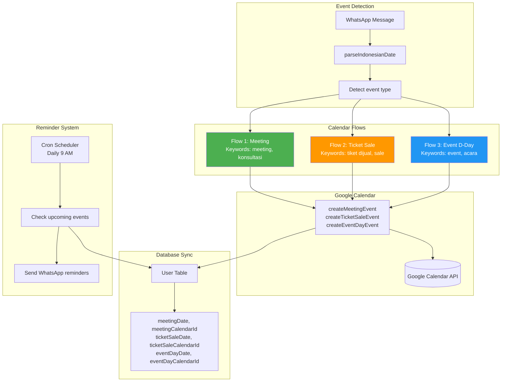
```mermaid
flowchart TB
    subgraph "Event Detection"
        MSG[WhatsApp Message]
        PARSE[parseIndonesianDate]
        DETECT[Detect event type]
    end

    subgraph "Calendar Flows"
        F1[Flow 1: Meeting<br/>Keywords: meeting, konsultasi]
        F2[Flow 2: Ticket Sale<br/>Keywords: tiket dijual, sale]
        F3[Flow 3: Event D-Day<br/>Keywords: event, acara]
    end

    subgraph "Google Calendar"
        CREATE[createMeetingEvent<br/>createTicketSaleEvent<br/>createEventDayEvent]
        GCAL[(Google Calendar API)]
    end

    subgraph "Database Sync"
        USER[User Table]
        FIELDS[meetingDate, meetingCalendarId<br/>ticketSaleDate, ticketSaleCalendarId<br/>eventDayDate, eventDayCalendarId]
    end

    subgraph "Reminder System"
        CRON[Cron Scheduler<br/>Daily 9 AM]
        CHECK[Check upcoming events]
        SEND[Send WhatsApp reminders]
    end

    MSG --> PARSE
    PARSE --> DETECT
    DETECT --> F1
    DETECT --> F2
    DETECT --> F3

    F1 --> CREATE
    F2 --> CREATE
    F3 --> CREATE

    CREATE --> GCAL
    CREATE --> USER
    USER --> FIELDS

    CRON --> CHECK
    CHECK --> USER
    CHECK --> SEND

    style F1 fill:#4CAF50,color:#fff
    style F2 fill:#FF9800,color:#fff
    style F3 fill:#2196F3,color:#fff
```

#### Flow Details

| Flow | Event Type | Database Fields | Reminder Schedule |
|------|-----------|----------------|-------------------|
| **Flow 1** | Meeting Appointment | `meetingDate`<br/>`meetingCalendarId`<br/>`meetingNotes` | 1 day before<br/>Same day (if later) |
| **Flow 2** | Ticket Sale Launch | `ticketSaleDate`<br/>`ticketSaleCalendarId`<br/>`ticketSaleNotes` | 3 days before<br/>1 day before |
| **Flow 3** | Event D-Day | `eventDayDate`<br/>`eventDayCalendarId`<br/>`eventDayVenue`<br/>`eventDayNotes` | 1 week before<br/>1 day before |

#### Date Parsing (Indonesian Support)

```javascript
// Supported formats:
parseIndonesianDate("15/12/2025")          // Numeric: DD/MM/YYYY
parseIndonesianDate("15-12-2025")          // Numeric: DD-MM-YYYY
parseIndonesianDate("15 Desember 2025")    // Text: DD Month YYYY
parseIndonesianDate("15 Des 2025")         // Text: DD MonthAbbr YYYY
parseIndonesianDate("besok")               // Relative: tomorrow
parseIndonesianDate("lusa")                // Relative: day after tomorrow
parseIndonesianDate("minggu depan")        // Relative: next week
parseIndonesianDate("bulan depan")         // Relative: next month
```

#### Bidirectional Sync

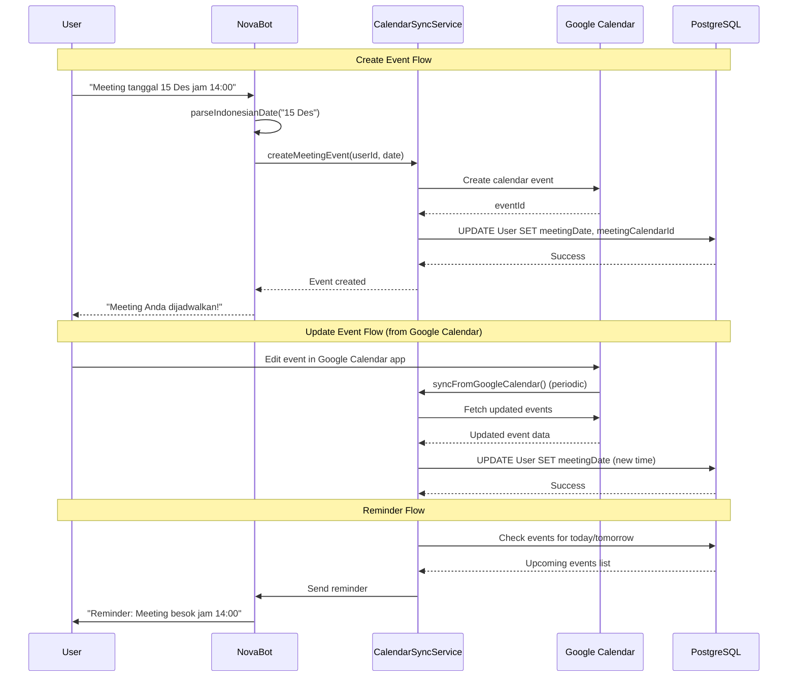
```mermaid
sequenceDiagram
    participant User
    participant Agent as NovaBot
    participant Sync as CalendarSyncService
    participant GCal as Google Calendar
    participant DB as PostgreSQL

    Note over User,DB: Create Event Flow
    User->>Agent: "Meeting tanggal 15 Des jam 14:00"
    Agent->>Agent: parseIndonesianDate("15 Des")
    Agent->>Sync: createMeetingEvent(userId, date)
    Sync->>GCal: Create calendar event
    GCal-->>Sync: eventId
    Sync->>DB: UPDATE User SET meetingDate, meetingCalendarId
    DB-->>Sync: Success
    Sync-->>Agent: Event created
    Agent-->>User: "Meeting Anda dijadwalkan!"

    Note over User,DB: Update Event Flow (from Google Calendar)
    User->>GCal: Edit event in Google Calendar app
    GCal->>Sync: syncFromGoogleCalendar() (periodic)
    Sync->>GCal: Fetch updated events
    GCal-->>Sync: Updated event data
    Sync->>DB: UPDATE User SET meetingDate (new time)
    DB-->>Sync: Success

    Note over User,DB: Reminder Flow
    Sync->>DB: Check events for today/tomorrow
    DB-->>Sync: Upcoming events list
    Sync->>Agent: Send reminder
    Agent->>User: "Reminder: Meeting besok jam 14:00"
```

### 3.4 Context Extraction (Snippets)

#### Intent Detector: `extractContextFromMessage()`

**Purpose:** Auto-extract CRM data from unstructured conversation

**Extraction Rules:**

```javascript
// File: apps/whatsapp-bot/src/agent/novabot.js (line 193-402)

const extractedContext = {
  // Name extraction
  nama: detectName(message),           // "Saya John Doe" → "John Doe"

  // Organization extraction
  instansi: detectOrganization(message), // "dari Acme Corp" → "Acme Corp"

  // Event extraction
  event: detectEvent(message),         // "untuk Tech Summit" → "Tech Summit"

  // Numeric extraction
  ticketPrice: extractNumber(message, ['harga', 'tiket']),  // "tiket 150rb" → 150000
  capacity: extractNumber(message, ['kapasitas', 'orang']), // "500 orang" → 500

  // Date extraction (3 types)
  meetingDate: detectMeetingDate(message),      // "meeting 15 Des"
  ticketSaleDate: detectTicketSaleDate(message), // "tiket dijual 1 Maret"
  eventDayDate: detectEventDate(message),       // "acara 20 Juni"

  // Status inference
  dealStatus: inferDealStatus(message)  // "setuju" → "deal"
};
```

#### Auto-Update Flow

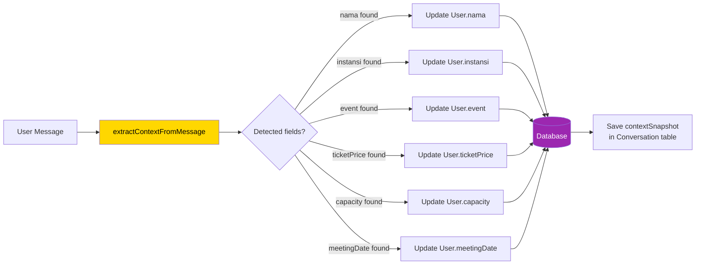
```mermaid
flowchart LR
    MSG[User Message] --> EXTRACT[extractContextFromMessage]
    EXTRACT --> DETECT{Detected fields?}

    DETECT -->|nama found| UPD_NAMA[Update User.nama]
    DETECT -->|instansi found| UPD_INST[Update User.instansi]
    DETECT -->|event found| UPD_EVENT[Update User.event]
    DETECT -->|ticketPrice found| UPD_PRICE[Update User.ticketPrice]
    DETECT -->|capacity found| UPD_CAP[Update User.capacity]
    DETECT -->|meetingDate found| UPD_MEET[Update User.meetingDate]

    UPD_NAMA --> DB[(Database)]
    UPD_INST --> DB
    UPD_EVENT --> DB
    UPD_PRICE --> DB
    UPD_CAP --> DB
    UPD_MEET --> DB

    DB --> SNAPSHOT[Save contextSnapshot<br/>in Conversation table]

    style EXTRACT fill:#FFD700,color:#000
    style DB fill:#9C27B0,color:#fff
```

#### Context Snapshot Example

```json
// Stored in Conversation.contextSnapshot (JSONB)
{
  "beforeExtraction": {
    "nama": null,
    "instansi": null,
    "event": null
  },
  "afterExtraction": {
    "nama": "John Doe",
    "instansi": "Acme Corporation",
    "event": "Tech Summit 2025"
  },
  "extractedFrom": "Halo, saya John Doe dari Acme Corporation untuk Tech Summit 2025",
  "timestamp": "2025-10-28T10:30:00Z"
}
```

### Integration Summary

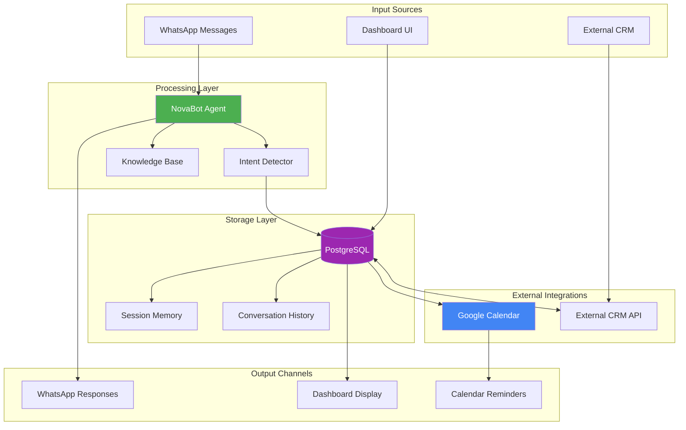
```mermaid
graph TB
    subgraph "Input Sources"
        WA[WhatsApp Messages]
        DASH[Dashboard UI]
        EXT[External CRM]
    end

    subgraph "Processing Layer"
        AGENT[NovaBot Agent]
        INTENT[Intent Detector]
        KB[Knowledge Base]
    end

    subgraph "Storage Layer"
        DB[(PostgreSQL)]
        SESS[Session Memory]
        HIST[Conversation History]
    end

    subgraph "External Integrations"
        GCAL[Google Calendar]
        CRM[External CRM API]
    end

    subgraph "Output Channels"
        WARES[WhatsApp Responses]
        DASHOUT[Dashboard Display]
        REMIND[Calendar Reminders]
    end

    WA --> AGENT
    DASH --> DB
    EXT --> CRM

    AGENT --> INTENT
    AGENT --> KB
    INTENT --> DB

    DB --> SESS
    DB --> HIST
    DB --> GCAL
    DB <--> CRM

    GCAL --> REMIND
    DB --> DASHOUT
    AGENT --> WARES

    style AGENT fill:#4CAF50,color:#fff
    style DB fill:#9C27B0,color:#fff
    style GCAL fill:#4285F4,color:#fff
```

---

## 4. Comprehensive Architecture Diagrams

### 4.1 System Architecture Overview

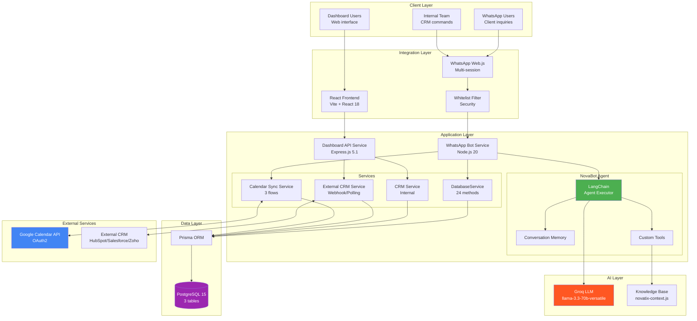
```mermaid
graph TB
    subgraph "Client Layer"
        U1[WhatsApp Users<br/>Client inquiries]
        U2[Internal Team<br/>CRM commands]
        U3[Dashboard Users<br/>Web interface]
    end

    subgraph "Integration Layer"
        WA[WhatsApp Web.js<br/>Multi-session]
        WL[Whitelist Filter<br/>Security]
        WEB[React Frontend<br/>Vite + React 18]
    end

    subgraph "Application Layer"
        BOT[WhatsApp Bot Service<br/>Node.js 20]
        API[Dashboard API Service<br/>Express.js 5.1]

        subgraph "NovaBot Agent"
            LC[LangChain<br/>Agent Executor]
            MEM[Conversation Memory]
            TOOLS[Custom Tools]
        end

        subgraph "Services"
            DBS[DatabaseService<br/>24 methods]
            CRMS[CRM Service<br/>Internal]
            EXTS[External CRM Service<br/>Webhook/Polling]
            CALS[Calendar Sync Service<br/>3 flows]
        end
    end

    subgraph "AI Layer"
        GROQ[Groq LLM<br/>llama-3.3-70b-versatile]
        KB[Knowledge Base<br/>novatix-context.js]
    end

    subgraph "Data Layer"
        PRISMA[Prisma ORM]
        PG[(PostgreSQL 15<br/>3 tables)]
    end

    subgraph "External Services"
        GCAL[Google Calendar API<br/>OAuth2]
        EXTCRM[External CRM<br/>HubSpot/Salesforce/Zoho]
    end

    U1 --> WA
    U2 --> WA
    U3 --> WEB

    WA --> WL
    WL --> BOT
    WEB --> API

    BOT --> LC
    LC --> MEM
    LC --> TOOLS
    LC --> GROQ
    TOOLS --> KB

    BOT --> DBS
    API --> CRMS
    API --> EXTS
    BOT --> CALS

    DBS --> PRISMA
    CRMS --> PRISMA
    EXTS --> PRISMA
    CALS --> PRISMA
    PRISMA --> PG

    CALS <--> GCAL
    EXTS <--> EXTCRM

    style LC fill:#4CAF50,color:#fff
    style GROQ fill:#FF5722,color:#fff
    style PG fill:#9C27B0,color:#fff
    style GCAL fill:#4285F4,color:#fff
```

### 4.2 Monorepo Structure

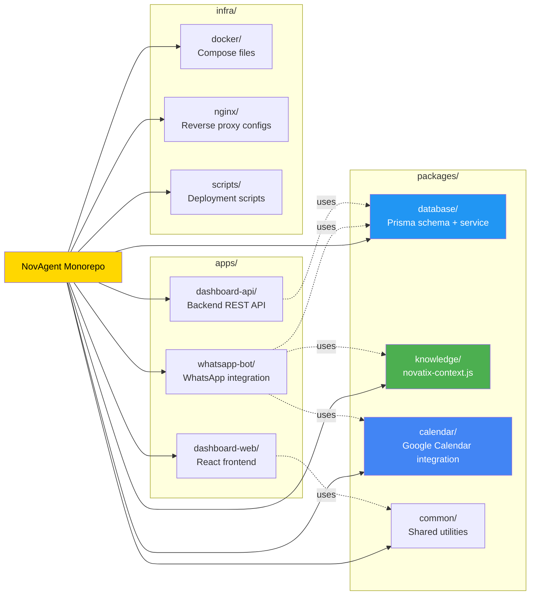
```mermaid
graph LR
    ROOT[NovAgent Monorepo]

    subgraph "apps/"
        WB[whatsapp-bot/<br/>WhatsApp integration]
        DA[dashboard-api/<br/>Backend REST API]
        DW[dashboard-web/<br/>React frontend]
    end

    subgraph "packages/"
        DB[database/<br/>Prisma schema + service]
        KB[knowledge/<br/>novatix-context.js]
        CAL[calendar/<br/>Google Calendar integration]
        COM[common/<br/>Shared utilities]
    end

    subgraph "infra/"
        DOC[docker/<br/>Compose files]
        NGX[nginx/<br/>Reverse proxy configs]
        SCR[scripts/<br/>Deployment scripts]
    end

    ROOT --> WB
    ROOT --> DA
    ROOT --> DW
    ROOT --> DB
    ROOT --> KB
    ROOT --> CAL
    ROOT --> COM
    ROOT --> DOC
    ROOT --> NGX
    ROOT --> SCR

    WB -.uses.-> DB
    WB -.uses.-> KB
    WB -.uses.-> CAL
    DA -.uses.-> DB
    DW -.uses.-> COM

    style ROOT fill:#FFD700,color:#000
    style DB fill:#2196F3,color:#fff
    style KB fill:#4CAF50,color:#fff
    style CAL fill:#4285F4,color:#fff
```

### 4.3 Deployment Architecture (Docker)

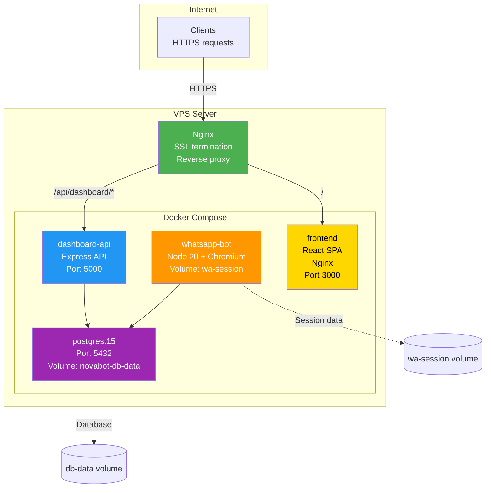
```mermaid
graph TB
    subgraph "Internet"
        CLIENT[Clients<br/>HTTPS requests]
    end

    subgraph "VPS Server"
        NGINX[Nginx<br/>SSL termination<br/>Reverse proxy]

        subgraph "Docker Compose"
            C1[postgres:15<br/>Port 5432<br/>Volume: novabot-db-data]
            C2[whatsapp-bot<br/>Node 20 + Chromium<br/>Volume: wa-session]
            C3[dashboard-api<br/>Express API<br/>Port 5000]
            C4[frontend<br/>React SPA<br/>Nginx<br/>Port 3000]
        end
    end

    CLIENT -->|HTTPS| NGINX
    NGINX -->|/ | C4
    NGINX -->|/api/dashboard/*| C3

    C2 --> C1
    C3 --> C1

    C2 -.Session data.-> VOL1[(wa-session volume)]
    C1 -.Database.-> VOL2[(db-data volume)]

    style NGINX fill:#4CAF50,color:#fff
    style C1 fill:#9C27B0,color:#fff
    style C2 fill:#FF9800,color:#fff
    style C3 fill:#2196F3,color:#fff
    style C4 fill:#FFD700,color:#000
```

### 4.4 Complete Data Flow Diagram

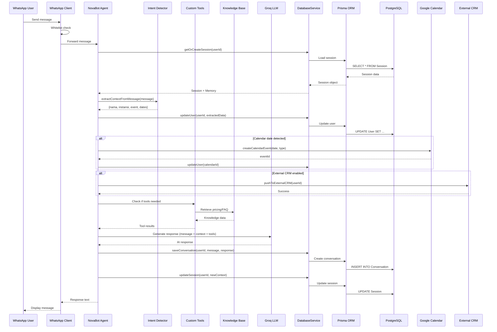
```mermaid
sequenceDiagram
    participant User as WhatsApp User
    participant WA as WhatsApp Client
    participant Agent as NovaBot Agent
    participant Intent as Intent Detector
    participant Tools as Custom Tools
    participant KB as Knowledge Base
    participant Model as Groq LLM
    participant DB as DatabaseService
    participant Prisma as Prisma ORM
    participant PG as PostgreSQL
    participant GCal as Google Calendar
    participant CRM as External CRM

    User->>WA: Send message
    WA->>WA: Whitelist check
    WA->>Agent: Forward message

    Agent->>DB: getOrCreateSession(userId)
    DB->>Prisma: Load session
    Prisma->>PG: SELECT * FROM Session
    PG-->>Prisma: Session data
    Prisma-->>DB: Session object
    DB-->>Agent: Session + Memory

    Agent->>Intent: extractContextFromMessage(message)
    Intent-->>Agent: {nama, instansi, event, dates}

    Agent->>DB: updateUser(userId, extractedData)
    DB->>Prisma: Update user
    Prisma->>PG: UPDATE User SET ...

    alt Calendar date detected
        Agent->>GCal: createCalendarEvent(date, type)
        GCal-->>Agent: eventId
        Agent->>DB: updateUser(calendarId)
    end

    alt External CRM enabled
        Agent->>CRM: pushToExternalCRM(userId)
        CRM-->>Agent: Success
    end

    Agent->>Tools: Check if tools needed
    Tools->>KB: Retrieve pricing/FAQ
    KB-->>Tools: Knowledge data
    Tools-->>Agent: Tool results

    Agent->>Model: Generate response (message + context + tools)
    Model-->>Agent: AI response

    Agent->>DB: saveConversation(userId, message, response)
    DB->>Prisma: Create conversation
    Prisma->>PG: INSERT INTO Conversation

    Agent->>DB: updateSession(userId, newContext)
    DB->>Prisma: Update session
    Prisma->>PG: UPDATE Session

    Agent-->>WA: Response text
    WA-->>User: Display message
```

### 4.5 Database Entity Relationships (Detailed)

```mermaid
erDiagram
    User ||--o{ Conversation : "userId"
    User ||--o| Session : "userId"

    User {
        varchar_255 id PK "WhatsApp ID"
        varchar_255 nama "Auto-extracted from chat"
        varchar_255 instansi "Auto-extracted from chat"
        varchar_255 event "Auto-extracted from chat"
        int ticketPrice "Auto-extracted from chat"
        int capacity "Auto-extracted from chat"
        varchar_50 pricingScheme "Selected by user"
        varchar_50 dealStatus "prospect|negotiating|deal|lost"
        text notes "CRM notes"
        timestamp meetingDate "Calendar Flow 1"
        varchar_255 meetingCalendarId "Google Calendar event ID"
        timestamp ticketSaleDate "Calendar Flow 2"
        varchar_255 ticketSaleCalendarId "Google Calendar event ID"
        timestamp eventDayDate "Calendar Flow 3"
        varchar_255 eventDayCalendarId "Google Calendar event ID"
        jsonb remindersSent "Tracks sent reminders"
        timestamp createdAt "Auto-generated"
        timestamp updatedAt "Auto-updated"
    }

    Conversation {
        uuid id PK "Auto-generated UUID"
        varchar_255 userId FK "References User.id"
        text userMessage "Full user input"
        text agentResponse "Full bot reply"
        jsonb toolsUsed "Array of tool names"
        jsonb contextSnapshot "CRM state at message time"
        timestamp timestamp "Message time"
    }

    Session {
        uuid id PK "Auto-generated UUID"
        varchar_255 userId FK_UNIQUE "References User.id (one-to-one)"
        jsonb context "LangChain memory serialized"
        int conversationCount "Number of exchanges"
        timestamp lastActive "Last message timestamp"
        timestamp expiresAt "Auto-expire time"
    }
```

### 4.6 Tool System Architecture

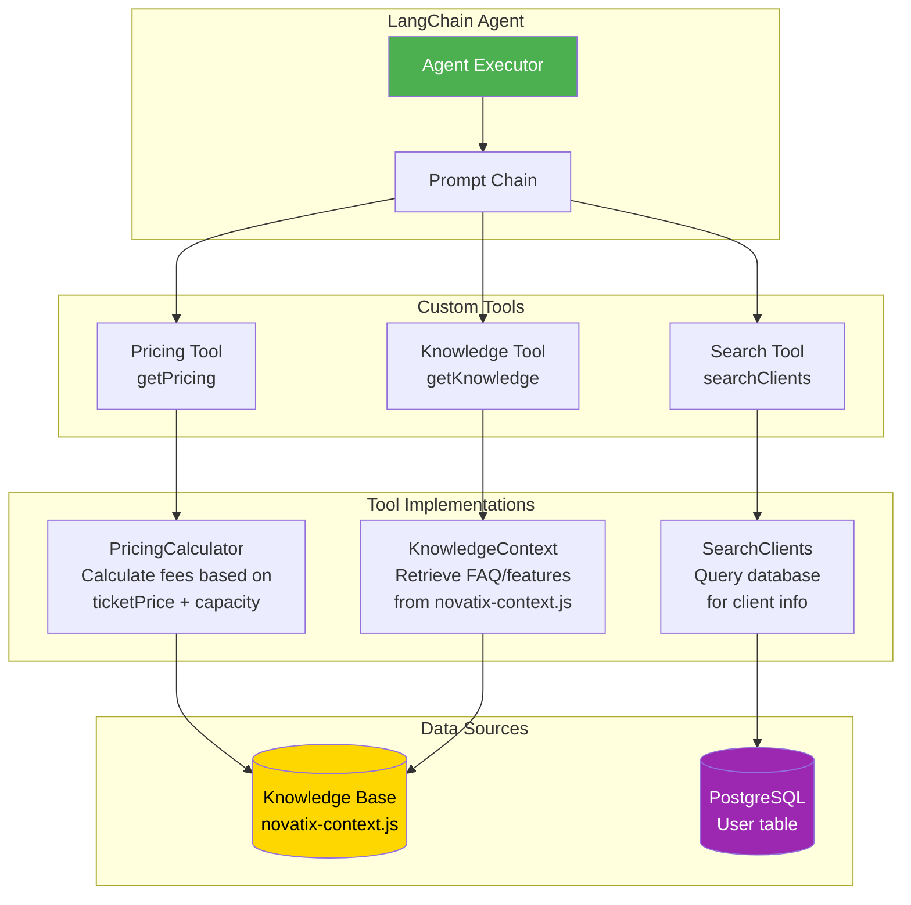
```mermaid
graph TB
    subgraph "LangChain Agent"
        AGENT[Agent Executor]
        CHAIN[Prompt Chain]
    end

    subgraph "Custom Tools"
        PT[Pricing Tool<br/>getPricing]
        KT[Knowledge Tool<br/>getKnowledge]
        ST[Search Tool<br/>searchClients]
    end

    subgraph "Tool Implementations"
        PC[PricingCalculator<br/>Calculate fees based on<br/>ticketPrice + capacity]
        KC[KnowledgeContext<br/>Retrieve FAQ/features<br/>from novatix-context.js]
        SC[SearchClients<br/>Query database<br/>for client info]
    end

    subgraph "Data Sources"
        KB[(Knowledge Base<br/>novatix-context.js)]
        DB[(PostgreSQL<br/>User table)]
    end

    AGENT --> CHAIN
    CHAIN --> PT
    CHAIN --> KT
    CHAIN --> ST

    PT --> PC
    KT --> KC
    ST --> SC

    PC --> KB
    KC --> KB
    SC --> DB

    style AGENT fill:#4CAF50,color:#fff
    style KB fill:#FFD700,color:#000
    style DB fill:#9C27B0,color:#fff
```

---

## Summary

### Key Architectural Principles

1. **Separation of Concerns**
   - Agent layer (AI logic) ← → Service layer (business logic) ← → Data layer (persistence)
   - Each package has single responsibility

2. **Memory-Backed Persistence**
   - Short-term: LangChain ConversationBufferMemory (in-process)
   - Long-term: PostgreSQL Session + Conversation tables
   - Enables multi-instance deployment + crash recovery

3. **Event-Driven Integrations**
   - Google Calendar: Bidirectional sync (create events ← → detect changes)
   - External CRM: Webhook (push) + Polling (pull) + API push
   - WhatsApp: Event-based message handling

4. **Automatic Context Extraction**
   - Intent detector parses unstructured text → structured CRM data
   - Auto-updates User table during conversation
   - Context snapshots in Conversation table for audit trail

5. **Tool-Augmented LLM**
   - LangChain tools extend LLM capabilities
   - Pricing calculations, knowledge retrieval, database search
   - Reduces hallucination, provides accurate business logic

### Technology Stack Summary

| Layer | Technologies |
|-------|-------------|
| **AI** | LangChain, Groq (llama-3.3-70b-versatile) |
| **Runtime** | Node.js 20, ES Modules |
| **Database** | PostgreSQL 15, Prisma ORM |
| **Integration** | WhatsApp Web.js, Google Calendar API, REST APIs |
| **Backend** | Express.js 5.1 |
| **Frontend** | React 18, Vite |
| **Deployment** | Docker Compose, Nginx, SSL (Let's Encrypt) |
| **Testing** | Jest (270+ test cases) |

### Files Reference

| Component | File Path |
|-----------|-----------|
| **Agent** | `apps/whatsapp-bot/src/agent/novabot.js` |
| **Database Service** | `packages/database/src/database-service.js` |
| **Prisma Schema** | `packages/database/prisma/schema.prisma` |
| **Knowledge Base** | `packages/knowledge/src/novatix-context.js` |
| **Calendar Sync** | `packages/calendar/src/calendar-sync.js` |
| **External CRM** | `apps/dashboard-api/src/backend/services/externalCrmService.js` |
| **WhatsApp Client** | `apps/whatsapp-bot/src/integrations/whatsapp-client.js` |
| **Dashboard API** | `apps/dashboard-api/src/backend/server.js` |

---

**Document Version:** 1.0
**Last Updated:** October 28, 2025
**Author:** AgentZcy + Claude Code
**Status:** ✅ Complete
