# Tech Stack: Tools, Model, and DB Relationships

## Architecture Flow Diagram

This diagram shows the complete data flow from user input through the agent, tools, model, and database layers.

## Components Explained

### NovaBot Agent (Core Orchestrator)
- **File:** `apps/whatsapp-bot/src/agent/novabot.js`
- **Key Methods:**
  - `chat()` - Main conversation handler
  - `extractContextFromMessage()` - Auto-extracts CRM data
  - `buildSystemPrompt()` - Constructs context-aware prompts
  - `resetConversation()` - Clears session memory

### Tools System (LangChain Custom Tools)
- **Pricing Tool:** Calculates pricing based on ticket price + capacity
- **Knowledge Tool:** Retrieves FAQ and product information
- **Intent Detector:** Extracts structured data from unstructured text

### Model Layer (Groq LLM)
- Uses `llama-3.3-70b-versatile` for production
- Alternative: `llama-3.1-8b-instant` for faster responses
- System prompts include NovaTix product knowledge and user context

### Database Service Layer
- **File:** `packages/database/src/database-service.js`
- **24 Methods** for CRUD, analytics, and search
- Key operations: user management, conversation history, session state

## Message Processing Flow

```mermaid
sequenceDiagram
    participant User as WhatsApp User
    participant WA as WhatsApp Client
    participant Agent as NovaBot Agent
    participant Tools as Custom Tools
    participant Model as Groq LLM
    participant DB as DatabaseService
    participant PG as PostgreSQL

    User->>WA: "Meeting tanggal 15 Des, event capacity 500"
    WA->>Agent: Whitelist check ✓
    Agent->>DB: getOrCreateSession(userId)
    DB->>PG: SELECT/INSERT Session
    PG-->>DB: Session data
    DB-->>Agent: Session + Memory context

    Agent->>Tools: extractContextFromMessage(message)
    Tools-->>Agent: {event: detected, capacity: 500, meetingDate: "2025-12-15"}

    Agent->>DB: updateUser(userId, {capacity: 500})
    DB->>PG: UPDATE User SET capacity=500

    Agent->>Model: chat(message + context)
    Model-->>Agent: AI response

    Agent->>DB: saveConversation(userId, message, response)
    DB->>PG: INSERT Conversation

    Agent->>DB: updateSession(userId, newContext)
    DB->>PG: UPDATE Session

    Agent-->>WA: Response text
    WA-->>User: WhatsApp message
```

## Technology Stack

| Component | Technology | Purpose |
|-----------|------------|---------|
| **AI Agent** | LangChain + Groq LLM | Conversational AI orchestration |
| **LLM Model** | llama-3.3-70b-versatile | Natural language understanding |
| **Database** | PostgreSQL 15 + Prisma ORM | Persistent storage |
| **Tools** | Custom LangChain Tools | Pricing calculation, knowledge retrieval |
| **Integration** | WhatsApp Web.js | Multi-user messaging |
