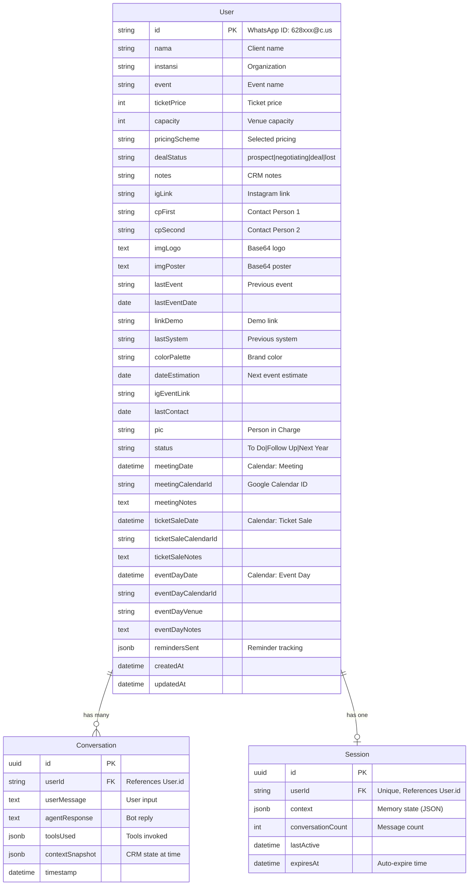
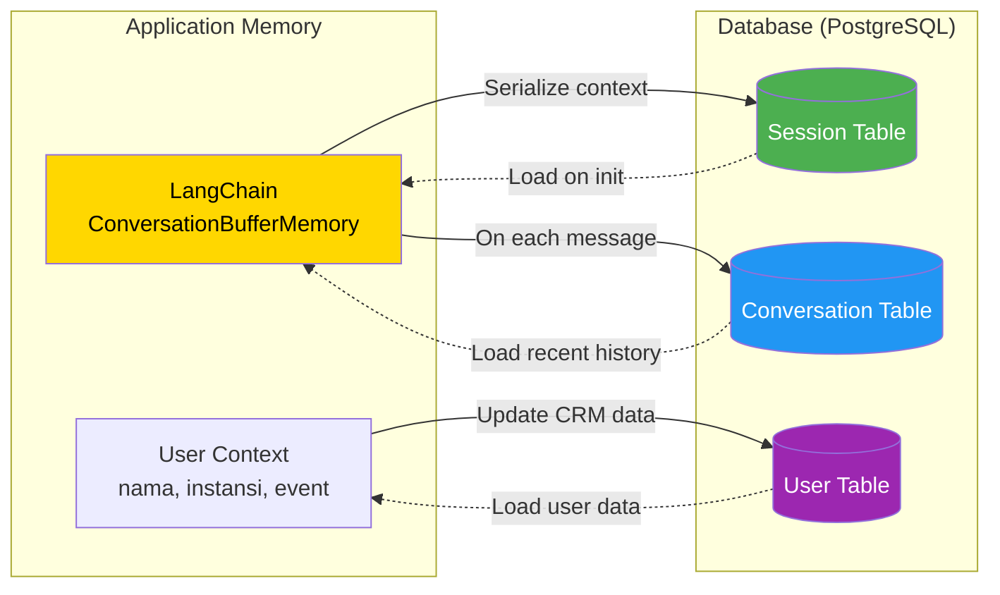
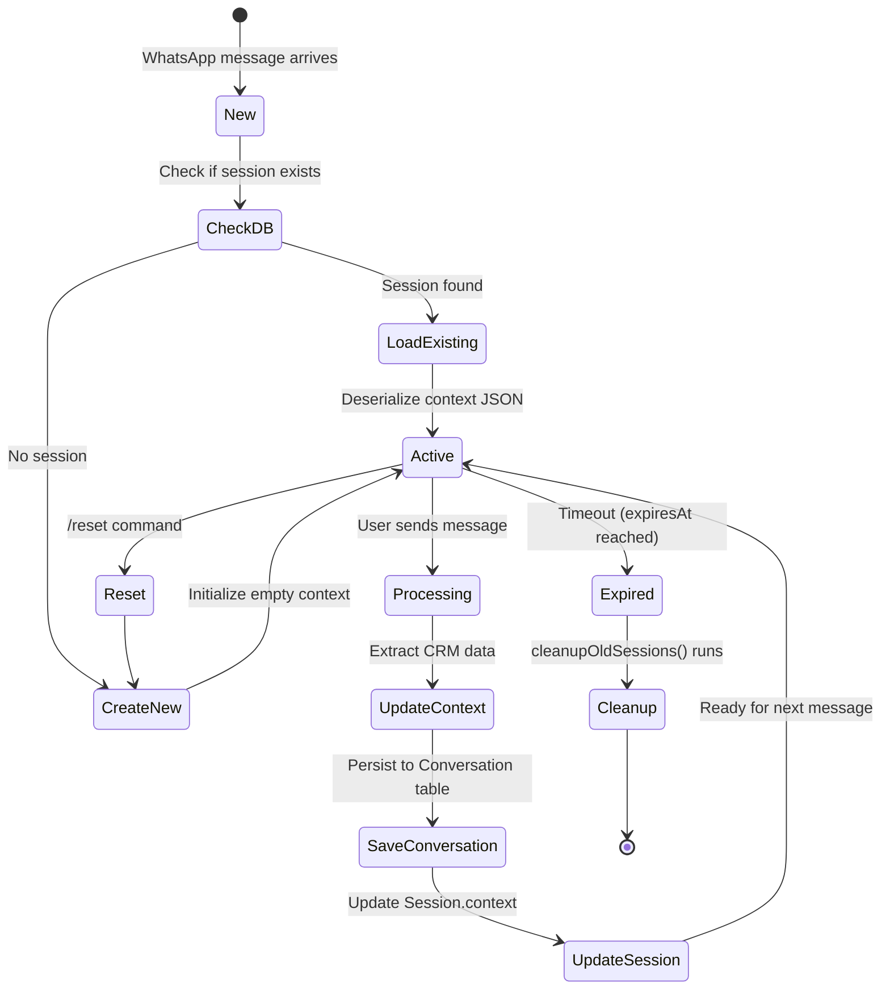

# Memory = Database Architecture

## Core Concept

NovAgent implements a **hybrid memory system** where:
- **Short-term memory:** LangChain `ConversationBufferMemory` (in-process)
- **Long-term memory:** PostgreSQL `Session` + `Conversation` tables (persistent)

## Database Schema



## Table Details

### 1. User Table (CRM Data)
- **Primary Key:** `id` (WhatsApp ID format: `628123456789@c.us`)
- **CRM Fields:** Basic customer info (nama, instansi, event, ticketPrice, capacity)
- **Dashboard Fields:** Extended CRM data from legacy system
- **Calendar Fields:** Google Calendar integration (3 event types)
- **Indexes:** Optimized for search (nama, instansi, dealStatus, status, pic, createdAt)

### 2. Conversation Table (Long-term History)
- **Purpose:** Persistent chat history for analysis and context
- **Key Fields:**
  - `userMessage` / `agentResponse` - Full conversation text
  - `toolsUsed` - JSON array of invoked tools
  - `contextSnapshot` - CRM state at time of message
- **Cascade Delete:** When User deleted, all conversations auto-delete
- **Indexes:** Compound index on `(userId, timestamp DESC)` for fast retrieval

### 3. Session Table (Active Memory State)
- **Purpose:** Active conversation context (replaces in-memory sessions)
- **Key Fields:**
  - `context` - JSON blob storing LangChain memory state
  - `conversationCount` - Number of exchanges in current session
  - `lastActive` - Last message timestamp (for auto-expire)
  - `expiresAt` - Configurable session timeout
- **One-to-One:** Each User has at most one active Session
- **Cleanup:** `cleanupOldSessions()` removes expired sessions

## Memory Persistence Flow



## Session Lifecycle



## Why This Architecture?

| Problem | Solution |
|---------|----------|
| **Process restart loses memory** | Session table persists context as JSON |
| **Multiple instances need shared state** | PostgreSQL provides centralized session store |
| **Analytics require full history** | Conversation table logs all exchanges |
| **CRM data extraction** | Intent detector auto-updates User table |
| **Session bloat** | Auto-expire + cleanup prevents unbounded growth |

## Key Database Service Methods

```javascript
// Session Management
getOrCreateSession(userId)      // Load or initialize session
updateSession(userId, context)  // Persist memory state
deleteSession(userId)            // Manual reset
cleanupOldSessions()            // Remove expired sessions

// Conversation History
saveConversation(userId, userMsg, agentMsg, tools, context)
getConversationHistory(userId, limit)
getRecentConversations(limit)

// User CRM
getOrCreateUser(userId)
updateUser(userId, data)
getUserWithHistory(userId)
findUserByPhoneOrName(query)

// Analytics
getOverallStats()               // Total users, conversations, sessions
getTodayActivity()              // Today's metrics
getActiveSessions()             // Currently active sessions
getUserStats(userId)            // Per-user metrics
```
