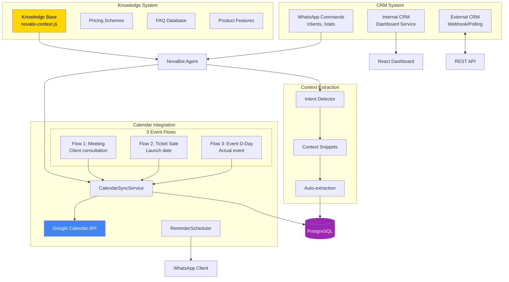
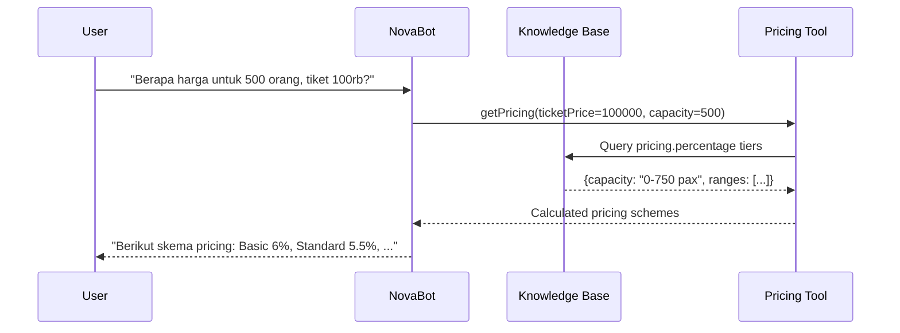
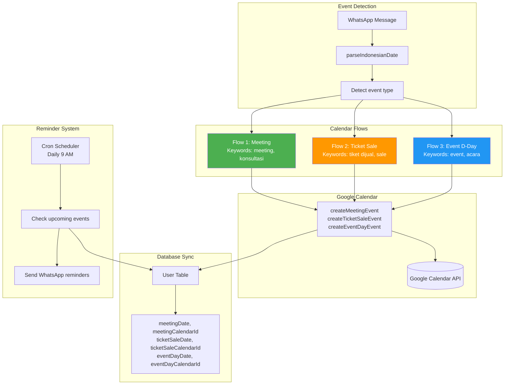
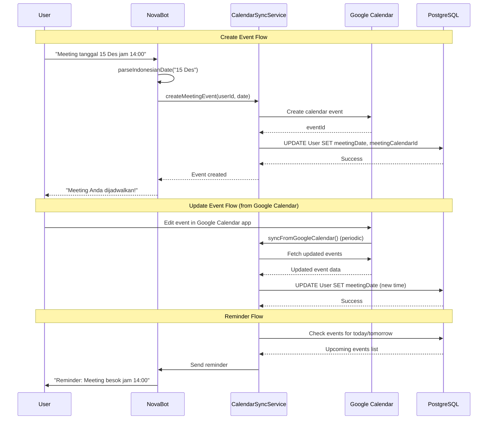
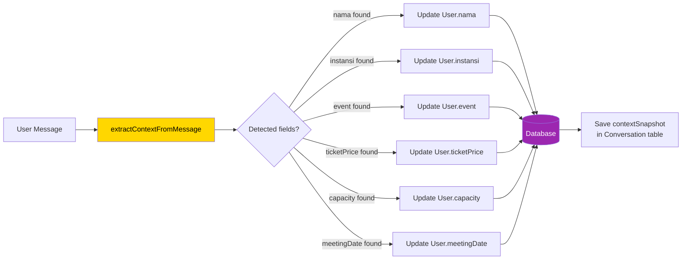

# Knowledge, CRM, and Google Calendar Integration

## Integration Overview



## 1. Knowledge Base System

### Structure: `packages/knowledge/src/novatix-context.js`

```javascript
export const novatixContext = {
  companyInfo: {
    name: "NovaTix",
    description: "Platform ticketing untuk seated venue",
    target: "Event Organizer (EO)"
  },

  features: {
    main: [
      { name: "Pemilihan Tiket Seat-Based", description: "..." },
      { name: "Payment Gateway Integration", description: "..." },
      { name: "E-Ticket Verification", description: "..." },
      { name: "Data Analytics", description: "..." }
    ]
  },

  pricing: {
    percentage: { tiers: [...] },
    package: { tiers: [...] }
  },

  faq: [
    { question: "...", answer: "..." }
  ]
}
```

### Knowledge Integration Flow



## 2. CRM Integration (Dual System)

### Internal CRM (Dashboard)
- **File:** `apps/dashboard-api/src/backend/services/crmService.js`
- React dashboard for client management
- Real-time conversation history
- Analytics and reporting

**API Endpoints:**
```
GET  /api/dashboard/users          # List all clients
GET  /api/dashboard/users/:id      # Get client details
PUT  /api/dashboard/users/:id      # Update client
GET  /api/dashboard/conversations/:userId  # Chat history
GET  /api/dashboard/stats          # Analytics
GET  /api/dashboard/search?q=...   # Search clients
```

### External CRM (Integration)
- **File:** `apps/dashboard-api/src/backend/services/externalCrmService.js`

**Supported Modes:**
1. **Webhook (Push):** External CRM → NovAgent
2. **Polling (Pull):** NovAgent → External CRM (scheduled)
3. **API Push:** NovAgent → External CRM (on-demand)

**Supported CRMs:**
- HubSpot
- Salesforce
- Zoho CRM
- Any REST-based CRM (customizable field mapping)

## 3. Google Calendar Integration (3 Event Flows)

### Calendar Sync Service
**File:** `packages/calendar/src/calendar-sync.js`



### Flow Details

| Flow | Event Type | Database Fields | Reminder Schedule |
|------|-----------|----------------|-------------------|
| **Flow 1** | Meeting Appointment | `meetingDate`<br/>`meetingCalendarId`<br/>`meetingNotes` | 1 day before<br/>Same day (if later) |
| **Flow 2** | Ticket Sale Launch | `ticketSaleDate`<br/>`ticketSaleCalendarId`<br/>`ticketSaleNotes` | 3 days before<br/>1 day before |
| **Flow 3** | Event D-Day | `eventDayDate`<br/>`eventDayCalendarId`<br/>`eventDayVenue`<br/>`eventDayNotes` | 1 week before<br/>1 day before |

### Bidirectional Sync



## 4. Context Extraction (Snippets)

### Intent Detector: `extractContextFromMessage()`

**File:** `apps/whatsapp-bot/src/agent/novabot.js` (line 193-402)

**Purpose:** Auto-extract CRM data from unstructured conversation

```javascript
const extractedContext = {
  // Name extraction
  nama: detectName(message),           // "Saya John Doe" → "John Doe"

  // Organization extraction
  instansi: detectOrganization(message), // "dari Acme Corp" → "Acme Corp"

  // Event extraction
  event: detectEvent(message),         // "untuk Tech Summit" → "Tech Summit"

  // Numeric extraction
  ticketPrice: extractNumber(message, ['harga', 'tiket']),  // "tiket 150rb" → 150000
  capacity: extractNumber(message, ['kapasitas', 'orang']), // "500 orang" → 500

  // Date extraction (3 types)
  meetingDate: detectMeetingDate(message),      // "meeting 15 Des"
  ticketSaleDate: detectTicketSaleDate(message), // "tiket dijual 1 Maret"
  eventDayDate: detectEventDate(message),       // "acara 20 Juni"

  // Status inference
  dealStatus: inferDealStatus(message)  // "setuju" → "deal"
};
```

### Auto-Update Flow



### Context Snapshot Example

```json
// Stored in Conversation.contextSnapshot (JSONB)
{
  "beforeExtraction": {
    "nama": null,
    "instansi": null,
    "event": null
  },
  "afterExtraction": {
    "nama": "John Doe",
    "instansi": "Acme Corporation",
    "event": "Tech Summit 2025"
  },
  "extractedFrom": "Halo, saya John Doe dari Acme Corporation untuk Tech Summit 2025",
  "timestamp": "2025-10-28T10:30:00Z"
}
```

## Supported Date Formats (Indonesian)

```javascript
// Numeric formats
parseIndonesianDate("15/12/2025")          // DD/MM/YYYY
parseIndonesianDate("15-12-2025")          // DD-MM-YYYY

// Text formats
parseIndonesianDate("15 Desember 2025")    // DD Month YYYY
parseIndonesianDate("15 Des 2025")         // DD MonthAbbr YYYY

// Relative formats
parseIndonesianDate("besok")               // tomorrow
parseIndonesianDate("lusa")                // day after tomorrow
parseIndonesianDate("minggu depan")        // next week
parseIndonesianDate("bulan depan")         // next month
```
