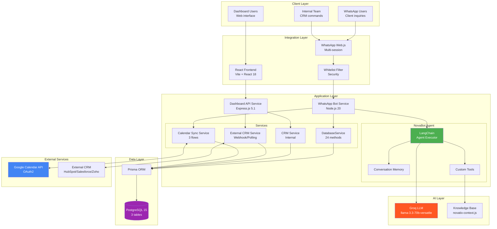
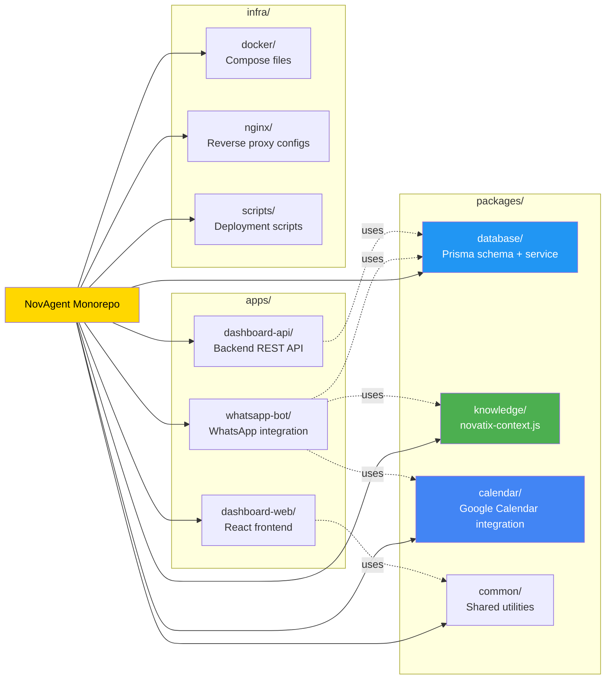
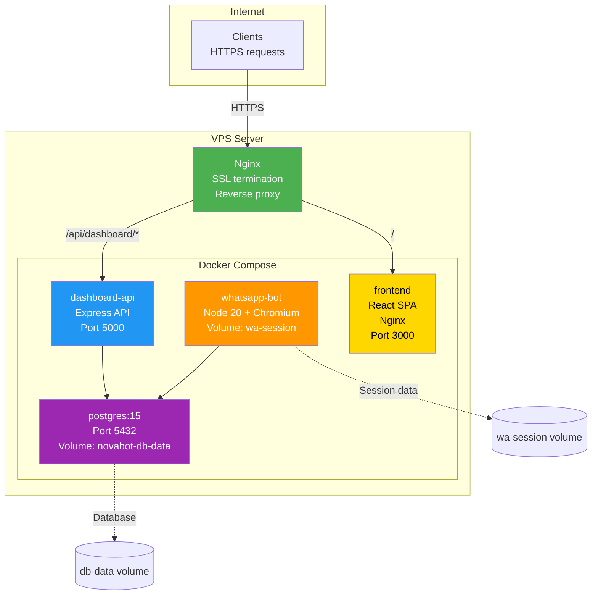
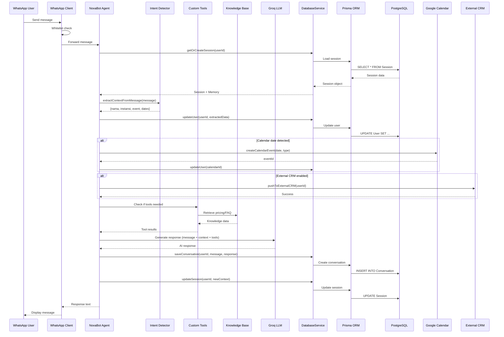
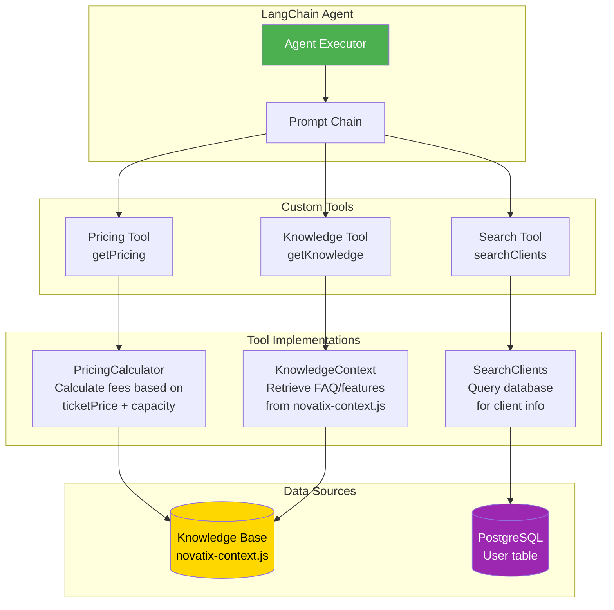

# Complete System Architecture

## System Overview

## Monorepo Structure

## Deployment Architecture (Docker)

## Complete Data Flow

## Tool System Architecture

## Technology Stack

| Layer | Technologies |
|-------|-------------|
| **AI** | LangChain, Groq (llama-3.3-70b-versatile) |
| **Runtime** | Node.js 20, ES Modules |
| **Database** | PostgreSQL 15, Prisma ORM |
| **Integration** | WhatsApp Web.js, Google Calendar API, REST APIs |
| **Backend** | Express.js 5.1 |
| **Frontend** | React 18, Vite |
| **Deployment** | Docker Compose, Nginx, SSL (Let's Encrypt) |
| **Testing** | Jest (270+ test cases) |

## Key Services

### WhatsApp Bot Service
- **Port:** Internal (no exposed port)
- **Technology:** Node.js 20 + Puppeteer/Chromium
- **Volume:** `novabot-wa-session` (persistent WhatsApp auth)
- **Features:** Multi-user sessions, whitelist filtering, command routing

### Dashboard API Service
- **Port:** 5000 (internal), proxied via Nginx
- **Technology:** Express.js 5.1
- **Endpoints:** `/api/dashboard/*`
- **Features:** REST API, CRM operations, external integrations

### Frontend Service
- **Port:** 3000 (internal), proxied via Nginx
- **Technology:** React 18 + Vite + Nginx (static serving)
- **Routes:** `/` (SPA)
- **Features:** Client management dashboard, conversation history

### PostgreSQL Service
- **Port:** 5432 (internal only)
- **Technology:** PostgreSQL 15
- **Volume:** `novabot-db-data` (persistent database)
- **Features:** 3 tables (User, Conversation, Session)

## File Reference

| Component | File Path |
|-----------|-----------|
| **Agent** | `apps/whatsapp-bot/src/agent/novabot.js` |
| **Database Service** | `packages/database/src/database-service.js` |
| **Prisma Schema** | `packages/database/prisma/schema.prisma` |
| **Knowledge Base** | `packages/knowledge/src/novatix-context.js` |
| **Calendar Sync** | `packages/calendar/src/calendar-sync.js` |
| **External CRM** | `apps/dashboard-api/src/backend/services/externalCrmService.js` |
| **WhatsApp Client** | `apps/whatsapp-bot/src/integrations/whatsapp-client.js` |
| **Dashboard API** | `apps/dashboard-api/src/backend/server.js` |
